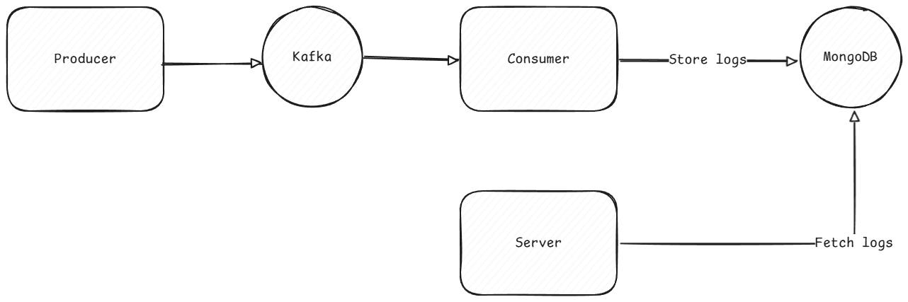

# Logs

# Architecture

# Usage

- Navigate to project root directory and execute:

```sh
docker compose up -d
```

- Now server is up and running on port 3000. You can fetch GET http://localhost:3000/user-activities?page=1&limit=10
